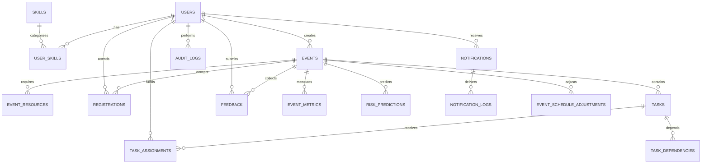

# Data Model And ERD

This document refines the original brief into a schema that will support maintainable CRUD, AI simulation, real-time updates, and notification history.

## Schema Decisions

- Use surrogate primary keys (`BIGINT`) for all major tables.
- Normalize skills instead of storing comma-separated values in the user record.
- Track in-app notifications separately from delivery attempts.
- Track task assignments separately so reassignments and scoring history are preserved.
- Keep event metrics as snapshots so health score trends can be reported later.

## Core Tables

### `users`

| Column | Type | Notes |
| --- | --- | --- |
| `user_id` | BIGINT PK | surrogate key |
| `email` | VARCHAR(150) UNIQUE | login identity |
| `password_hash` | VARCHAR(255) | hashed password |
| `first_name` | VARCHAR(80) | required |
| `last_name` | VARCHAR(80) | required |
| `role` | VARCHAR(30) | enum-backed |
| `user_status` | VARCHAR(30) | active or disabled flow |
| `availability_status` | VARCHAR(30) | primarily for volunteers |
| `performance_score` | DECIMAL(5,2) | derived score snapshot |
| `created_at` | TIMESTAMP | audit |
| `updated_at` | TIMESTAMP | audit |

### `skills`

| Column | Type | Notes |
| --- | --- | --- |
| `skill_id` | BIGINT PK | surrogate key |
| `name` | VARCHAR(80) UNIQUE | skill label |
| `description` | VARCHAR(255) | optional |

### `user_skills`

| Column | Type | Notes |
| --- | --- | --- |
| `user_skill_id` | BIGINT PK | surrogate key |
| `user_id` | BIGINT FK | references `users.user_id` |
| `skill_id` | BIGINT FK | references `skills.skill_id` |
| `proficiency_level` | VARCHAR(30) | optional scoring input |

### `events`

| Column | Type | Notes |
| --- | --- | --- |
| `event_id` | BIGINT PK | surrogate key |
| `code` | VARCHAR(40) UNIQUE | human-friendly reference |
| `name` | VARCHAR(150) | required |
| `description` | TEXT | optional |
| `category` | VARCHAR(80) | reporting and discovery |
| `venue` | VARCHAR(150) | required |
| `start_at` | TIMESTAMP | required |
| `end_at` | TIMESTAMP | required |
| `registration_open_at` | TIMESTAMP | optional |
| `registration_close_at` | TIMESTAMP | optional |
| `expected_attendance` | INT | required |
| `event_status` | VARCHAR(30) | enum-backed |
| `created_by` | BIGINT FK | admin owner |
| `updated_by` | BIGINT FK | last editor |
| `created_at` | TIMESTAMP | audit |
| `updated_at` | TIMESTAMP | audit |

### `event_resources`

| Column | Type | Notes |
| --- | --- | --- |
| `event_resource_id` | BIGINT PK | surrogate key |
| `event_id` | BIGINT FK | references `events.event_id` |
| `resource_name` | VARCHAR(100) | required |
| `quantity_required` | INT | required |
| `quantity_allocated` | INT | default 0 |
| `notes` | VARCHAR(255) | optional |

### `registrations`

| Column | Type | Notes |
| --- | --- | --- |
| `registration_id` | BIGINT PK | surrogate key |
| `event_id` | BIGINT FK | references `events.event_id` |
| `student_id` | BIGINT FK | references `users.user_id` |
| `registration_status` | VARCHAR(30) | enum-backed |
| `registered_at` | TIMESTAMP | required |
| `checked_in_at` | TIMESTAMP | nullable |

### `tasks`

| Column | Type | Notes |
| --- | --- | --- |
| `task_id` | BIGINT PK | surrogate key |
| `event_id` | BIGINT FK | references `events.event_id` |
| `title` | VARCHAR(150) | required |
| `description` | TEXT | optional |
| `task_priority` | VARCHAR(30) | enum-backed |
| `task_status` | VARCHAR(30) | enum-backed |
| `required_start_at` | TIMESTAMP | optional |
| `deadline_at` | TIMESTAMP | required |
| `required_volunteers` | INT | default 1 |
| `created_by` | BIGINT FK | organizer owner |
| `updated_by` | BIGINT FK | last editor |
| `created_at` | TIMESTAMP | audit |
| `updated_at` | TIMESTAMP | audit |

### `task_assignments`

| Column | Type | Notes |
| --- | --- | --- |
| `task_assignment_id` | BIGINT PK | surrogate key |
| `task_id` | BIGINT FK | references `tasks.task_id` |
| `volunteer_id` | BIGINT FK | references `users.user_id` |
| `assigned_by` | BIGINT FK | organizer or admin |
| `assignment_score` | DECIMAL(5,2) | smart assignment output |
| `assignment_reason` | VARCHAR(255) | manual or AI note |
| `is_active` | BOOLEAN | current assignment flag |
| `assigned_at` | TIMESTAMP | audit |

### `task_dependencies`

| Column | Type | Notes |
| --- | --- | --- |
| `task_dependency_id` | BIGINT PK | surrogate key |
| `task_id` | BIGINT FK | dependent task |
| `depends_on_task_id` | BIGINT FK | prerequisite task |

### `feedback`

| Column | Type | Notes |
| --- | --- | --- |
| `feedback_id` | BIGINT PK | surrogate key |
| `event_id` | BIGINT FK | references `events.event_id` |
| `student_id` | BIGINT FK | references `users.user_id` |
| `mood` | VARCHAR(30) | emoji-backed enum |
| `comment` | VARCHAR(500) | optional |
| `submitted_at` | TIMESTAMP | required |

### `event_metrics`

| Column | Type | Notes |
| --- | --- | --- |
| `event_metric_id` | BIGINT PK | surrogate key |
| `event_id` | BIGINT FK | references `events.event_id` |
| `snapshot_at` | TIMESTAMP | required |
| `registered_count` | INT | derived |
| `checked_in_count` | INT | derived |
| `attendance_ratio` | DECIMAL(5,2) | derived |
| `engagement_score` | DECIMAL(5,2) | derived |
| `volunteer_efficiency_score` | DECIMAL(5,2) | derived |
| `health_score` | DECIMAL(5,2) | derived |
| `risk_level` | VARCHAR(30) | current top risk level |

## Support Tables

### `risk_predictions`

| Column | Type | Notes |
| --- | --- | --- |
| `risk_prediction_id` | BIGINT PK | surrogate key |
| `event_id` | BIGINT FK | references `events.event_id` |
| `risk_type` | VARCHAR(50) | low attendance, shortage, conflict |
| `risk_level` | VARCHAR(30) | enum-backed |
| `score` | DECIMAL(5,2) | weighted output |
| `headline` | VARCHAR(150) | summary |
| `description` | VARCHAR(500) | explanation |
| `recommended_action` | VARCHAR(255) | next step |
| `generated_at` | TIMESTAMP | audit |

### `notifications`

| Column | Type | Notes |
| --- | --- | --- |
| `notification_id` | BIGINT PK | surrogate key |
| `recipient_user_id` | BIGINT FK | references `users.user_id` |
| `event_id` | BIGINT FK nullable | related event |
| `task_id` | BIGINT FK nullable | related task |
| `notification_type` | VARCHAR(50) | enum-backed |
| `severity` | VARCHAR(30) | info, warning, critical |
| `title` | VARCHAR(150) | short headline |
| `body` | VARCHAR(500) | content |
| `link_path` | VARCHAR(255) | UI navigation target |
| `is_read` | BOOLEAN | in-app state |
| `created_at` | TIMESTAMP | audit |
| `read_at` | TIMESTAMP | nullable |

### `notification_logs`

| Column | Type | Notes |
| --- | --- | --- |
| `notification_log_id` | BIGINT PK | surrogate key |
| `notification_id` | BIGINT FK | references `notifications.notification_id` |
| `channel` | VARCHAR(30) | email or in-app |
| `delivery_status` | VARCHAR(30) | sent, failed, retrying |
| `recipient_address` | VARCHAR(150) | email when relevant |
| `error_message` | VARCHAR(255) | nullable |
| `attempted_at` | TIMESTAMP | audit |

### `event_schedule_adjustments`

| Column | Type | Notes |
| --- | --- | --- |
| `event_schedule_adjustment_id` | BIGINT PK | surrogate key |
| `event_id` | BIGINT FK | references `events.event_id` |
| `proposed_by` | BIGINT FK | organizer or admin |
| `reason_code` | VARCHAR(50) | delay or conflict code |
| `description` | VARCHAR(500) | detail |
| `current_start_at` | TIMESTAMP | before change |
| `current_end_at` | TIMESTAMP | before change |
| `suggested_start_at` | TIMESTAMP | proposed window |
| `suggested_end_at` | TIMESTAMP | proposed window |
| `adjustment_status` | VARCHAR(30) | suggested, applied, rejected |
| `applied_at` | TIMESTAMP | nullable |

### `audit_logs`

| Column | Type | Notes |
| --- | --- | --- |
| `audit_log_id` | BIGINT PK | surrogate key |
| `actor_user_id` | BIGINT FK | references `users.user_id` |
| `entity_type` | VARCHAR(50) | event, user, task, registration |
| `entity_id` | BIGINT | target record |
| `action_type` | VARCHAR(50) | create, update, delete, status change |
| `payload_before_json` | JSON | nullable |
| `payload_after_json` | JSON | nullable |
| `created_at` | TIMESTAMP | audit |

## Mermaid ERD

## Key Constraints And Indexes

- Unique: `users.email`, `skills.name`, `events.code`, `registrations(event_id, student_id)`, `feedback(event_id, student_id)`.
- Indexes: `events(event_status, start_at)`, `tasks(event_id, task_status, deadline_at)`, `task_assignments(volunteer_id, is_active)`, `notifications(recipient_user_id, is_read, created_at)`, `event_metrics(event_id, snapshot_at)`.
- Foreign keys should use restrictive delete behavior for transactional data and cascade only for junction tables where safe.
- `task_dependencies` must reject cycles at the service layer before persistence.

## Migration Order

1. `users`, `skills`
2. `user_skills`
3. `events`, `event_resources`
4. `registrations`
5. `tasks`, `task_dependencies`, `task_assignments`
6. `feedback`, `event_metrics`, `risk_predictions`
7. `notifications`, `notification_logs`
8. `event_schedule_adjustments`, `audit_logs`